# solr学习笔记

# 一.需求分析

## 1.1 场景描述

​	在一些大型门户网站、电子商务网站等都需要站内搜索功能，使用传统的数据库查询方式实现搜索无法满足一些高级的搜索需求，比如：搜索速度要快、搜索结果按相关度排序、搜索内容格式不固定等，这里就需要使用全文检索技术实现搜索功能。 

**1.1.1 使用lucene实现**

​	单独使用Lucene实现站内搜索需要开发的工作量较大，主要表现在：索引维护、索引性能优化、搜索性能优化等，因此不建议采用。 

**1.1.2 使用solr实现**

​	基于Solr实现站内搜索扩展性较好并且可以减少程序员的工作量，因为Solr提供了较为完备的搜索引擎解决方案，因此在门户、论坛等系统中常用此方案。

 ## 1.2 什么是solr

​	Solr 是Apache下的一个顶级开源项目，采用Java开发，它是基于Lucene的全文搜索服务器。Solr提供了比Lucene更为丰富的查询语言，同时实现了可配置、可扩展，并对索引、搜索性能进行了优化。  

​	Solr可以独立运行，运行在Jetty、Tomcat等这些Servlet容器中，Solr 索引的实现方法很简单，用 POST 方法向 Solr 服务器发送一个描述 Field 及其内容的 XML 文档，Solr根据xml文档添加、删除、更新索引 。Solr 搜索只需要发送 HTTP GET 请求，然后对 Solr 返回Xml、json等格式的查询结果进行解析，组织页面布局。Solr不提供构建UI的功能，Solr提供了一个管理界面，通过管理界面可以查询Solr的配置和运行情况。 

**Solr与Lucene的区别：** 

​	Lucene是一个开放源代码的全文检索引擎工具包，它不是一个完整的全文检索引擎，Lucene提供了完整的查询引擎和索引引擎，目的是为软件开发人员提供一个简单易用的工具包，以方便的在目标系统中实现全文检索的功能，或者以Lucene为基础构建全文检索引擎。 

​	Solr的目标是打造一款企业级的搜索引擎系统，它是一个搜索引擎服务，可以独立运行，通过Solr可以非常快速的构建企业的搜索引擎，通过Solr也可以高效的完成站内搜索功能。 

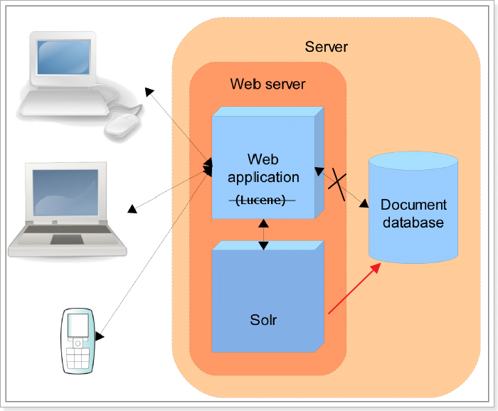

# 二.Solr安装及配置

## 2.1 Solr的下载

从Solr官方网站（http://lucene.apache.org/solr/ ）下载Solr4.10.3，根据Solr的运行环境，Linux下需要下载lucene-4.10.3.tgz，windows下需要下载lucene-4.10.3.zip。

Solr使用指南可参考：https://wiki.apache.org/solr/FrontPage。

## 2.2 Solr的文件夹结构

将solr-4.10.3.zip解压：

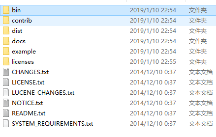

1. bin：solr的运行脚本

2. contrib：solr的一些贡献软件/插件，用于增强solr的功能。

3. dist：该目录包含build过程中产生的war和jar文件，以及相关的依赖文件。

4. docs：solr的API文档

5. example：solr工程的例子目录：

   * example/solr：该目录是一个包含了默认配置信息的Solr的Core目录。

   * example/multicore：该目录包含了在Solr的multicore中设置的多个Core目录。 

   * example/webapps：该目录中包括一个solr.war，该war可作为solr的运行实例工程。

     licenses：solr相关的一些许可信息

## 2.3 运行环境

solr 需要运行在一个Servlet容器中，Solr4.10.3要求jdk使用1.7以上，Solr默认提供Jetty（java写的Servlet容器），本教程使用Tocmat作为Servlet容器，环境如下： 

Solr：Solr4.10.3

Jdk：jdk1.7.0_72

Tomcat：apache-tomcat-7.0.53

## 2.4 Solr整合tomcat

**2.4.1 Solr Home与SolrCore**

创建一个Solr home目录，SolrHome是Solr运行的主目录，目录中包括了运行Solr实例所有的配置文件和数据文件，Solr实例就是SolrCore，一个SolrHome可以包括多个SolrCore（Solr实例），每个SolrCore提供单独的搜索和索引服务。

example\solr是一个solr home目录结构，如下： l

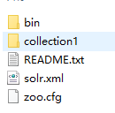

上图中“collection1”是一个SolrCore（Solr实例）目录 ，目录内容如下所示： 

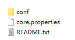

**说明：**

* collection1：叫做一个Solr运行实例SolrCore，SolrCore名称不固定，一个solr运行实例对外单独提供索引和搜索接口。

* solrHome中可以创建多个solr运行实例SolrCore。
* 一个solr的运行实例对应一个索引目录。
* conf是SolrCore的配置文件目录 。
* data目录存放索引文件需要创建

**2.4.2 整合步骤**

1. 安装tomcat。D:\temp\apache-tomcat-7.0.53

2. 把solr的war包复制到tomcat 的webapp目录下。把\solr-4.10.3\dist\solr-4.10.3.war复制到D:\temp\apache-tomcat-7.0.53\webapps下。改名为solr.war

3. solr.war解压。使用压缩工具解压或者启动tomcat自动解压。解压之后删除solr.war

4. 把\solr-4.10.3\example\lib\ext目录下的所有的jar包添加到solr工程中

5. 配置solrHome和solrCore。

   * 创建一个solrhome（存放solr所有配置文件的一个文件夹）。\solr-4.10.3\example\solr目录就是一个标准的solrhome。

   * 把\solr-4.10.3\example\solr文件夹复制到D:\temp\0108路径下，改名为solrhome，改名不是必须的，是为了便于理解。 

   * 在solrhome下有一个文件夹叫做collection1这就是一个solrcore。就是一个solr的实例。一个solrcore相当于mysql中一个数据库。Solrcore之间是相互隔离。 

     * 在solrcore中有一个文件夹叫做conf，包含了索引solr实例的配置信息。 

     * 在conf文件夹下有一个solrconfig.xml。配置实例的相关信息。**如果使用默认配置可以不用做任何修改。**

       **Xml的配置信息：**

       **Lib**：solr服务依赖的扩展包，默认的路径是collection1\lib文件夹，如果没有就创建一个

       **dataDir**：配置了索引库的存放路径。默认路径是collection1\data文件夹，如果没有data文件夹，会自动创建。

       requestHandler：

       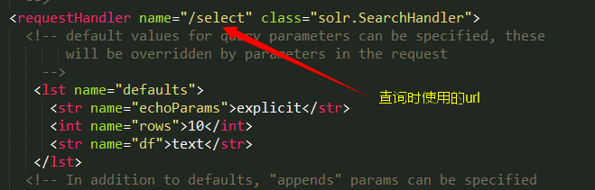 

       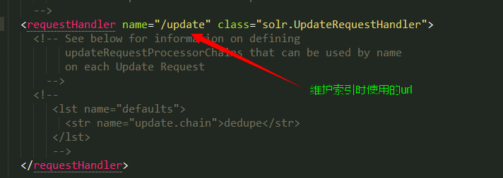

6. 告诉solr服务器配置文件也就是solrHome的位置。修改web.xml使用jndi的方式告诉solr服务器。**Solr/home名称必须是固定的,tomcat里的solr工程web.xml配置如下:**

   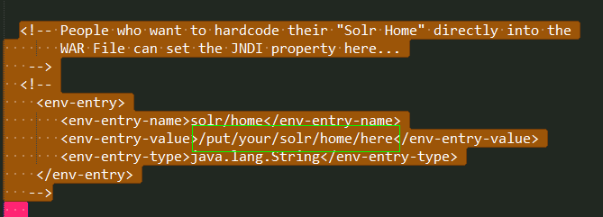

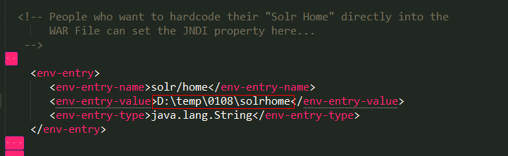

7. 启动tomcat
8. 访问http://localhost:8080/solr/


## 2.5 Solr后台管理

**2.5.1 管理界面**

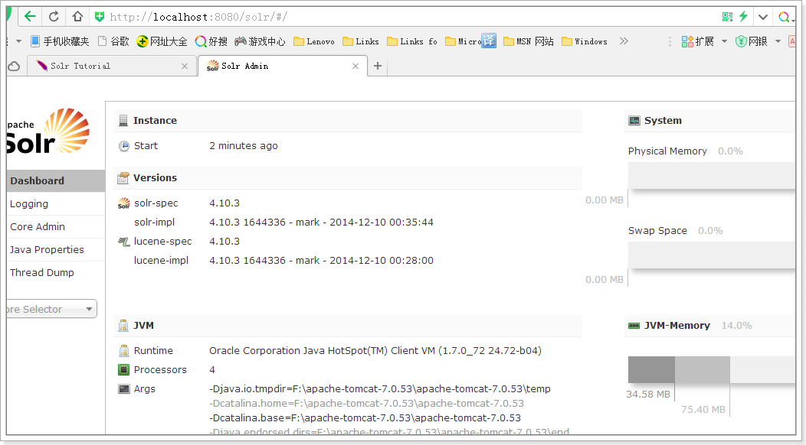

**2.5.2 Dashboard**

仪表盘，显示了该Solr实例开始启动运行的时间、版本、系统资源、jvm等信息。

**2.5.3 Logging**

Solr运行日志信息 。

**2.5.4 Cloud**

Cloud即SolrCloud，即Solr云（集群），当使用Solr Cloud模式运行时会显示此菜单，如下图是Solr Cloud的管理界面：

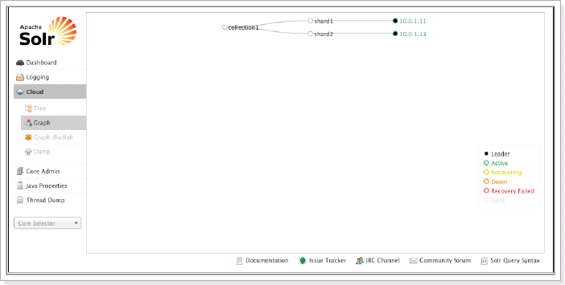

**2.5.5 Core Admin**

Solr Core的管理界面。Solr Core 是Solr的一个独立运行实例单位，它可以对外提供索引和搜索服务，一个Solr工程可以运行多个SolrCore（Solr实例），一个Core对应一个索引目录。 

添加solrcore：

第一步：复制collection1改名为collection2

第二步：修改core.properties。name=collection2

第三步：重启tomcat

**2.5.6 java properties**

Solr在JVM 运行环境中的属性信息，包括类路径、文件编码、jvm内存设置等信息。

**2.5.7 Tread Dump**

显示Solr Server中当前活跃线程信息，同时也可以跟踪线程运行栈信息。 

**2.5.8 Core selector**

选择一个SolrCore进行详细操作，如下：

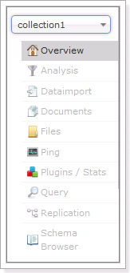

**2.5.9 Analysis**

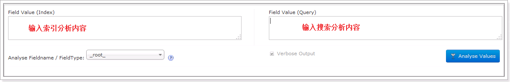

**2.5.10 Dataimport**

可以定义数据导入处理器，从关系数据库将数据导入 到Solr索引库中。

**2.5.11 Document** 

通过此菜单可以创建索引、更新索引、删除索引等操作，界面如下： 

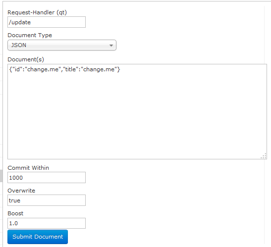


/update表示更新索引，solr默认根据id（唯一约束）域来更新Document的内容，如果根据id值搜索不到id域则会执行添加操作，如果找到则更新。 

**2.5.12 Query**

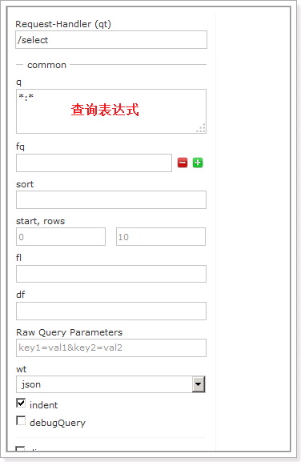

通过/select执行搜索索引，必须指定“q”查询条件方可搜索。

## 2.6 配置中文分析器

**2.6.1 Schema.xml**

schema.xml，在SolrCore的conf目录下，它是Solr数据表配置文件，它定义了加入索引的数据的数据类型的。主要包括FieldTypes、Fields和其他的一些缺省设置。 

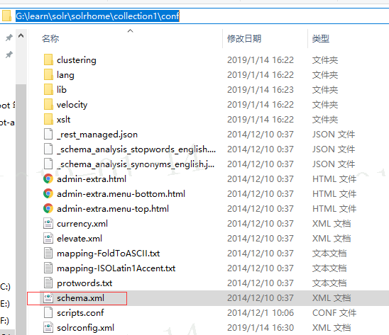

**2.6.2 FieldType域类型定义**

下边“text_general”是Solr默认提供的FieldType，通过它说明FieldType定义的内容： 

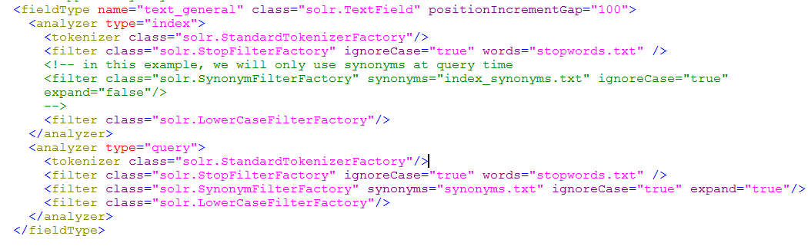

FieldType子结点包括：name,class,positionIncrementGap等一些参数：

name：是这个FieldType的名称

class：是Solr提供的包solr.TextField，solr.TextField 允许用户通过分析器来定制索引和查询，分析器包括一个分词器（tokenizer）和多个过滤器（filter）

positionIncrementGap：可选属性，定义在同一个文档中此类型数据的空白间隔，避免短语匹配错误，此值相当于Lucene的短语查询设置slop值，根据经验设置为100。在FieldType定义的时候最重要的就是定义这个类型的数据在建立索引和进行查询的时候要使用的分析器analyzer,包括分词和过滤。

索引分析器中：使用solr.StandardTokenizerFactory标准分词器，solr.StopFilterFactory停用词过滤器，solr.LowerCaseFilterFactory小写过滤器。

搜索分析器中：使用solr.StandardTokenizerFactory标准分词器，solr.StopFilterFactory停用词过滤器，这里还用到了solr.SynonymFilterFactory同义词过滤器。

**2.6.3 Field定义**

在fields结点内定义具体的Field，filed定义包括name,type（为之前定义过的各种FieldType）,indexed（是否被索引）,stored（是否被储存），multiValued（是否存储多个值）等属性。 如下：

```xml
<field name="name" type="text_general" indexed="true" stored="true"/>
<field name="features" type="text_general" indexed="true" stored="true" multiValued="true"/>
```

multiValued：该Field如果要存储多个值时设置为true，solr允许一个Field存储多个值，比如存储一个用户的好友id（多个），商品的图片（多个，大图和小图），通过使用solr查询要看出返回给客户端是数组： 

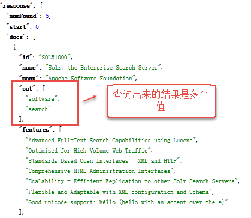

**2.6.4 uniqueKey**

Solr中默认定义唯一主键key为id域，如下： 

```xml
<uniqueKey>id</uniqueKey>
```

Solr在删除、更新索引时使用id域进行判断，也可以自定义唯一主键。注意在创建索引时必须指定唯一约束。

**2.6.5 copyField复制域**

copyField复制域，可以将多个Field复制到一个Field中，以便进行统一的检索：

比如，输入关键字搜索title标题内容content，定义title、content、text的域： 

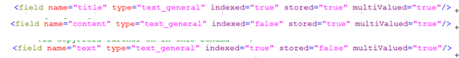

根据关键字只搜索text域的内容就相当于搜索title和content，将title和content复制到text中，如下： 

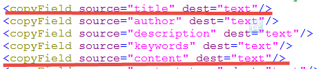

**2.6.5 dynamicField（动态字段）**

动态字段就是不用指定具体的名称，只要定义字段名称的规则，例如定义一个 dynamicField，name 为*_i，定义它的type为text，那么在使用这个字段的时候，任何以_i结尾的字段都被认为是符合这个定义的，例如：name_i，gender_i，school_i等。 

自定义Field名为：product_title_t，“product_title_t”和scheam.xml中的dynamicField规则匹配成功，如下： 

```xml
<dynamicField name="*_t" type="text_general" indexed="true" stored="true"></dynamicField>
```

“product_title_t”是以“_t”结尾。

创建索引： 

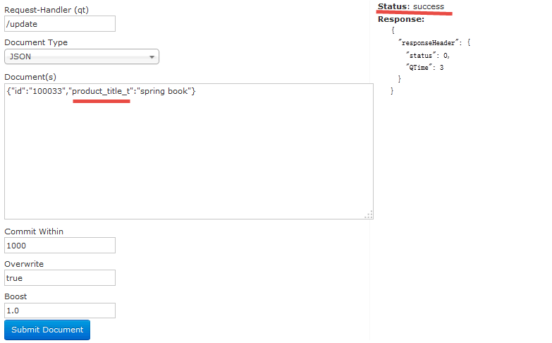

搜索索引： 

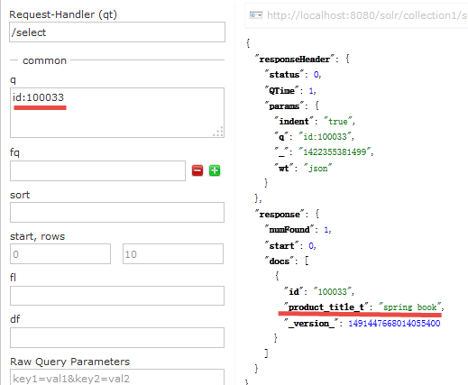

**2.6.6 安装中文分词器**

使用IKAnalyzer中文分析器。

第一步：把IKAnalyzer2012FF_u1.jar添加到solr/WEB-INF/lib目录下。

第二步：复制IKAnalyzer的配置文件和自定义词典和停用词词典到solr的classpath下。

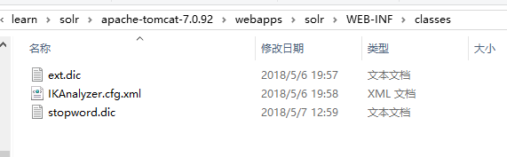

第三步：在schema.xml中添加一个自定义的fieldType，使用中文分析器。

```xml
<!-- IKAnalyzer-->
    <fieldType name="text_ik" class="solr.TextField">
      <analyzer class="org.wltea.analyzer.lucene.IKAnalyzer"/>
    </fieldType>

```

第四步：定义field，指定field的type属性为text_ik 

```xml
<!--IKAnalyzer Field-->
   <field name="title_ik" type="text_ik" indexed="true" stored="true" />
   <field name="content_ik" type="text_ik" indexed="true" stored="false" multiValued="true"/>

```

第五步：重启tomcat 资源

测试：

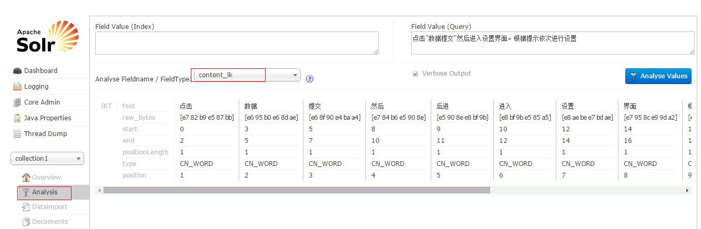

## 4.7设置业务系统Field

如果不使用Solr提供的Field可以针对具体的业务需要自定义一套Field，如下是商品信息Field： 

```xml
<!--product-->
   <field name="product_name" type="text_ik" indexed="true" stored="true"/>
   <field name="product_price"  type="float" indexed="true" stored="true"/>
   <field name="product_description" type="text_ik" indexed="true" stored="false" />
   <field name="product_picture" type="string" indexed="false" stored="true" />
   <field name="product_catalog_name" type="string" indexed="true" stored="true" />

   <field name="product_keywords" type="text_ik" indexed="true" stored="false" multiValued="true"/>
   <copyField source="product_name" dest="product_keywords"/>
   <copyField source="product_description" dest="product_keywords"/>

```

# 三.Solr管理索引库

## 3.1 添加/更新文档

添加或更新单个文档 

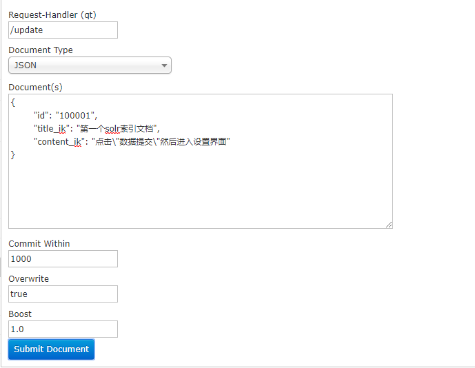

## 3.2 批量导入数据

使用dataimport插件批量导入数据。

第一步：把dataimport插件依赖的jar包添加到solrcore（collection1\lib）中,还需要mysql的数据库驱动。

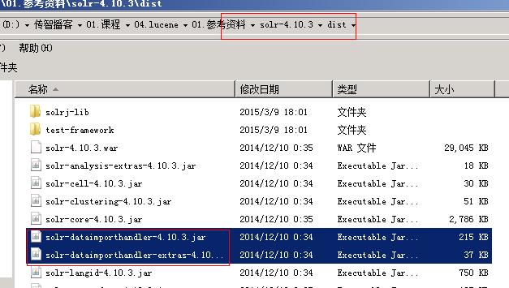

第二步：配置solrconfig.xml文件，添加一个requestHandler。

```xml
 <requestHandler name="/dataimport" 
class="org.apache.solr.handler.dataimport.DataImportHandler">
    <lst name="defaults">
      <str name="config">data-config.xml</str>
     </lst>
  </requestHandler> 

```

第三步：创建一个data-config.xml，保存到collection1\conf\目录下 。

```xml
<?xml version="1.0" encoding="UTF-8" ?>  
<dataConfig>   
<dataSource type="JdbcDataSource"   
		  driver="com.mysql.jdbc.Driver"   
		  url="jdbc:mysql://localhost:3306/develop"   
		  user="root"   
		  password="123456"/>   
<document>   
	<entity name="tb_user" query="SELECT id,username,age FROM tb_user ">
		 <field column="id" name="id"/> 
		 <field column="username" name="username"/> 
		 <field column="age" name="age"/> 
	</entity>   
</document>   

</dataConfig>

```

第四步：重启tomcat 

第五步：点击“execute”按钮导入数据 。

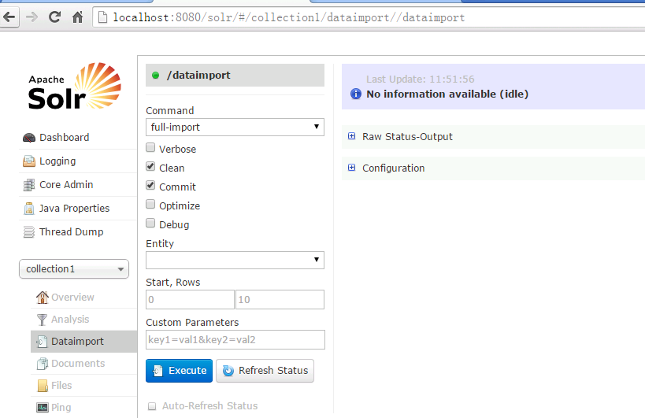

**导入数据前会先清空索引库，然后再导入。**

## 3.3 删除文档

删除索引格式如下：

1. 删除制定ID的索引 

   ```xml
   <delete>
   	<id>8</id>
   </delete>
   <commit/>
   ```

2. 删除查询到的索引数据

   ```xml
   <delete>
   	<query>product_catalog_name:幽默杂货</query>
   </delete>
   ```

3. 删除所有索引数据 

   ```xml
   <delete>
   	<query>*:*</query>
   </delete>
   ```

## 3.4 查询索引

通过/select搜索索引，Solr制定一些参数完成不同需求的搜索：

1. q-查询字符串，必须的，如果查询所有使用\*:\*。

   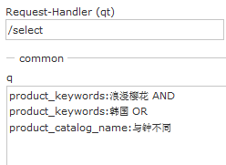

2. fq - （filter query）过虑查询，作用：在q查询符合结果中同时是fq查询符合的，例如:

   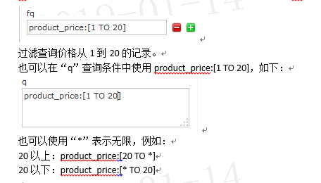

   3. sort - 排序，格式：sort=<field name>+<desc|asc>[,<field name>+<desc|asc>]… 。示例：  

      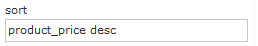

      按价格降序 

   4.  start - 分页显示使用，开始记录下标，从0开始 。

   5.  rows - 指定返回结果最多有多少条记录，配合start来实现分页。

      

   6. fl - 指定返回那些字段内容，用逗号或空格分隔多个。 

      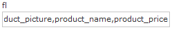

      显示商品图片、商品名称、商品价格 

   7. df-指定一个搜索Field

      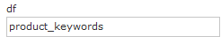

   8. wt - (writer type)指定输出格式，可以有 xml, json, php, phps, 后面 solr 1.3增加的，要用通知我们，因为默认没有打开。 

   9. hl 是否高亮 ,设置高亮Field，设置格式前缀和后缀。 

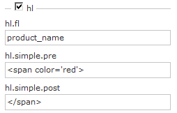


# 四.使用SolrJ管理索引库

## 4.1 什么是solrJ

solrj是访问Solr服务的java客户端，提供索引和搜索的请求方法，SolrJ通常在嵌入在业务系统中，通过SolrJ的API接口操作Solr服务，如下图：

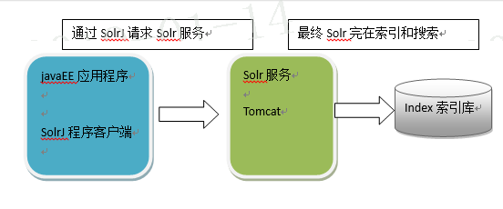

## 4.2 实现步骤

1. 引入依赖

   ```xml
   <dependency>
   	<groupId>org.apache.solr</groupId>
   	<artifactId>solr-solrj</artifactId>
   	<version>5.3.1</version>
   </dependency>	
   ```

   注意solrj编译依赖下面jar包 ,使用maven会自动依赖

   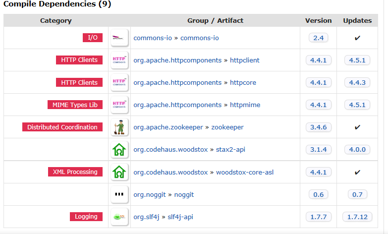

   2. 和Solr服务器建立连接。HttpSolrServer对象建立连接。 

   3. 创建一个SolrInputDocument对象，然后添加域。 

   4. 将SolrInputDocument添加到索引库。 

   5. 提交。 

      ```java
      //向索引库中添加索引
      	@Test
      	public void addDocument() throws Exception {
      		//和solr服务器创建连接
      		//参数：solr服务器的地址
      		SolrServer solrServer = new HttpSolrServer("http://localhost:8080/solr");
      		//创建一个文档对象
      		SolrInputDocument document = new SolrInputDocument();
      		//向文档中添加域
      		//第一个参数：域的名称，域的名称必须是在schema.xml中定义的
      		//第二个参数：域的值
      		document.addField("id", "c0001");
      		document.addField("title_ik", "使用solrJ添加的文档");
      		document.addField("content_ik", "文档的内容");
      		//把document对象添加到索引库中
      		solrServer.add(document);
      		//提交修改
      		solrServer.commit();
      		
      	}
      
      ```

   

   ## 4.3 删除文档

   **4.3.1 根据id删除**

   ```java
   //删除文档，根据id删除
   	@Test
   	public void deleteDocumentByid() throws Exception {
   		//创建连接
   		SolrServer solrServer = new HttpSolrServer("http://localhost:8080/solr");
   		//根据id删除文档
   		solrServer.deleteById("c0001");
   		//提交修改
   		solrServer.commit();
   	}
   
   ```

   **4.3.2 根据查询删除**

   查询语法完全支持Lucene的查询语法。

   ```java
   //根据查询条件删除文档
   	@Test
   	public void deleteDocumentByQuery() throws Exception {
   		//创建连接
   		SolrServer solrServer = new HttpSolrServer("http://localhost:8080/solr");
   		//根据查询条件删除文档
   		solrServer.deleteByQuery("*:*");
   		//提交修改
   		solrServer.commit();
   	}
   
   ```

   ## 4.4 修改文档

   在solrJ中修改没有对应的update方法，只有add方法，只需要添加一条新的文档，和被修改的文档id一致就，可以修改了。本质上就是先删除后添加。 

   ## 4.5 查询文档

    **4.5.1 简单查询**

   ```java
   //查询索引
   	@Test
   	public void queryIndex() throws Exception {
   		//创建连接
   		SolrServer solrServer = new HttpSolrServer("http://localhost:8080/solr");
   		//创建一个query对象
   		SolrQuery query = new SolrQuery();
   		//设置查询条件
   		query.setQuery("*:*");
   		//执行查询
   		QueryResponse queryResponse = solrServer.query(query);
   		//取查询结果
   		SolrDocumentList solrDocumentList = queryResponse.getResults();
   		//共查询到商品数量
   		System.out.println("共查询到商品数量:" + solrDocumentList.getNumFound());
   		//遍历查询的结果
   		for (SolrDocument solrDocument : solrDocumentList) {
   			System.out.println(solrDocument.get("id"));
   			System.out.println(solrDocument.get("product_name"));
   			System.out.println(solrDocument.get("product_price"));
   			System.out.println(solrDocument.get("product_catalog_name"));
   			System.out.println(solrDocument.get("product_picture"));
   			
   		}
   	}
   
   ```

   **4.5.2 复杂查询**

   其中包含查询、过滤、分页、排序、高亮显示等处理。 

   ```java
   //复杂查询索引
   	@Test
   	public void queryIndex2() throws Exception {
   		//创建连接
   		SolrServer solrServer = new HttpSolrServer("http://localhost:8080/solr");
   		//创建一个query对象
   		SolrQuery query = new SolrQuery();
   		//设置查询条件
   		query.setQuery("钻石");
   		//过滤条件
   		query.setFilterQueries("product_catalog_name:幽默杂货");
   		//排序条件
   		query.setSort("product_price", ORDER.asc);
   		//分页处理
   		query.setStart(0);
   		query.setRows(10);
   		//结果中域的列表
   		query.setFields("id","product_name","product_price","product_catalog_name","product_picture");
   		//设置默认搜索域
   		query.set("df", "product_keywords");
   		//高亮显示
   		query.setHighlight(true);
   		//高亮显示的域
   		query.addHighlightField("product_name");
   		//高亮显示的前缀
   		query.setHighlightSimplePre("<em>");
   		//高亮显示的后缀
   		query.setHighlightSimplePost("</em>");
   		//执行查询
   		QueryResponse queryResponse = solrServer.query(query);
   		//取查询结果
   		SolrDocumentList solrDocumentList = queryResponse.getResults();
   		//共查询到商品数量
   		System.out.println("共查询到商品数量:" + solrDocumentList.getNumFound());
   		//遍历查询的结果
   		for (SolrDocument solrDocument : solrDocumentList) {
   			System.out.println(solrDocument.get("id"));
   			//取高亮显示
   			String productName = "";
   			Map<String, Map<String, List<String>>> highlighting = queryResponse.getHighlighting();
   			List<String> list = highlighting.get(solrDocument.get("id")).get("product_name");
   			//判断是否有高亮内容
   			if (null != list) {
   				productName = list.get(0);
   			} else {
   				productName = (String) solrDocument.get("product_name");
   			}
   			
   			System.out.println(productName);
   			System.out.println(solrDocument.get("product_price"));
   			System.out.println(solrDocument.get("product_catalog_name"));
   			System.out.println(solrDocument.get("product_picture"));
   			
   		}
   	}
   
   ```

   

# 五.工程搭建

## 5.1 系统架构

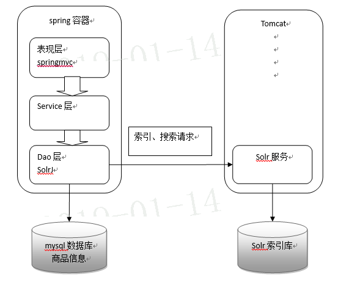

## 5.2 工程搭建

创建一个web工程导入jar包

1、springmvc的相关jar包

2、solrJ的jar包

3、Example\lib\ext下的jar包

**5.2.1 springmvc.xml**

```xml
<?xml version="1.0" encoding="UTF-8"?>
<beans xmlns="http://www.springframework.org/schema/beans"
	xmlns:xsi="http://www.w3.org/2001/XMLSchema-instance" xmlns:p="http://www.springframework.org/schema/p"
	xmlns:context="http://www.springframework.org/schema/context"
	xmlns:mvc="http://www.springframework.org/schema/mvc"
	xsi:schemaLocation="http://www.springframework.org/schema/beans http://www.springframework.org/schema/beans/spring-beans-4.0.xsd
        http://www.springframework.org/schema/mvc http://www.springframework.org/schema/mvc/spring-mvc-4.0.xsd
        http://www.springframework.org/schema/context http://www.springframework.org/schema/context/spring-context-4.0.xsd">
        
	<context:component-scan base-package="com.itheima.jd"/>
	<!-- 配置注解驱动，如果配置此标签可以不用配置处理器映射器和适配器 -->
	<mvc:annotation-driven/>
		<!-- 配置视图解析器 -->
	<bean class="org.springframework.web.servlet.view.InternalResourceViewResolver">
		<property name="prefix" value="/WEB-INF/jsp/"/>
		<property name="suffix" value=".jsp"/>
	</bean>
	<!-- SolrServer的配置 -->
	<bean id="httpSolrServer" class="org.apache.solr.client.solrj.impl.HttpSolrServer">
		<constructor-arg index="0" value="http://localhost:8080/solr"/>
	</bean>
</beans>

```

**5.2.2 web.xml**

```xml
<?xml version="1.0" encoding="UTF-8"?>
<web-app xmlns:xsi="http://www.w3.org/2001/XMLSchema-instance" xmlns="http://java.sun.com/xml/ns/javaee" xsi:schemaLocation="http://java.sun.com/xml/ns/javaee http://java.sun.com/xml/ns/javaee/web-app_2_5.xsd" id="WebApp_ID" version="2.5">
  <display-name>solr-jd</display-name>
  <welcome-file-list>
    <welcome-file>index.html</welcome-file>
    <welcome-file>index.htm</welcome-file>
    <welcome-file>index.jsp</welcome-file>
    <welcome-file>default.html</welcome-file>
    <welcome-file>default.htm</welcome-file>
    <welcome-file>default.jsp</welcome-file>
  </welcome-file-list>
  <!-- 配置前段控制器 -->
  <servlet>
  	<servlet-name>springmvc</servlet-name>
  	<servlet-class>org.springframework.web.servlet.DispatcherServlet</servlet-class>
  	<init-param>
  		<!-- 指定springmvc配置文件的路径 
  			如果不指定默认为：/WEB-INF/${servlet-name}-servlet.xml
  		-->
  		<param-name>contextConfigLocation</param-name>
  		<param-value>classpath:springmvc.xml</param-value>
  	</init-param>
  </servlet>
  <servlet-mapping>
  	<servlet-name>springmvc</servlet-name>
  	<url-pattern>*.action</url-pattern>
  </servlet-mapping>
  <!-- 解决post乱码问题 -->
  <filter>
		<filter-name>CharacterEncodingFilter</filter-name>
		<filter-class>org.springframework.web.filter.CharacterEncodingFilter</filter-class>
		<init-param>
			<param-name>encoding</param-name>
			<param-value>utf-8</param-value>
		</init-param>
	</filter>
	<filter-mapping>
		<filter-name>CharacterEncodingFilter</filter-name>
		<url-pattern>/*</url-pattern>
	</filter-mapping>
</web-app>

```

## 5.3 Dao

功能：接收service层传递过来的参数，根据参数查询索引库，返回查询结果。

参数：SolrQuery对象

返回值：一个商品列表List<ProductModel>。

方法定义：public List<ProductModel> getResultModelFromSolr(QueryVo vo) throws Exception;

商品对象模型：

```java
public class ProductModel {
	// 商品编号
	private String pid;
	// 商品名称
	private String name;
	// 商品分类名称
	private String catalog_name;
	// 价格
	private float price;
	// 商品描述
	private String description;
	// 图片名称
	private String picture;
}

```

```java
@Repository
public class SolrDaoImpl implements SolrDao {
	@Autowired
	private SolrServer solrServer;
	
	public List<ProductModel> getResultModelFromSolr(QueryVo vo) throws Exception{
		SolrQuery solrQuery = new SolrQuery();
		//关键词
		if(null != vo.getQueryString() && !"".equals(vo.getQueryString())){
			solrQuery.setQuery(vo.getQueryString());
			solrQuery.set("df", "product_keywords");
			
		}
		//商品类型
		if(null != vo.getCatalog_name() && !"".equals(vo.getCatalog_name().trim())){
			solrQuery.addFilterQuery("product_catalog_name:" + vo.getCatalog_name());
		}
		//价格
		if(null != vo.getPrice() && !"".equals(vo.getPrice().trim())){
			String[] split = vo.getPrice().split("-");
			if(split.length == 2){
				solrQuery.addFilterQuery("product_price:[" + split[0] + " TO " + split[1] + "]");
			}else{
				solrQuery.addFilterQuery("product_price:[" + split[0] + " TO *]");
			}
		}
		//价格排序
		if("1".equals(vo.getSort())){
			solrQuery.setSort("product_price", ORDER.desc);
		}else{
			solrQuery.setSort("product_price", ORDER.asc);
		}
		
		//显示的域
		//solrQuery.setFields("id,product_name,product_price");
		
		//1:设置高亮开关
		solrQuery.setHighlight(true);
		//2：需要高亮的域
		solrQuery.addHighlightField("product_name");
		//3：高亮的简单样式  前缀
		solrQuery.setHighlightSimplePre("<span style='color:red'>");
		//4：高亮的简单样式 后缀
		solrQuery.setHighlightSimplePost("</span>");
		QueryResponse response = solrServer.query(solrQuery);
		//取出高亮
		Map<String, Map<String, List<String>>> highlighting = response.getHighlighting();
	
		//取出结果集
		SolrDocumentList docs = response.getResults();
		//打印总条数
		System.out.println("总条数：" + docs.getNumFound());
		//结果集
		List<ProductModel> productModels = new ArrayList<ProductModel>();
		//閬嶅巻
		for (SolrDocument doc : docs) {
			
			ProductModel productModel = new ProductModel();
			//ID
			String id = (String) doc.get("id");
			productModel.setPid(id);
			//
			Map<String, List<String>> map = highlighting.get(id);
			List<String> list = map.get("product_name");
			//判断高亮必须不为空
			if(null != list && list.size() > 0){
				String name = list.get(0);
				productModel.setName(name);
			}
			//价格
			productModel.setPrice((float) doc.get("product_price"));
			//商品图片
			productModel.setPicture((String) doc.get("product_picture"));
			//商品类型
			productModel.setCatalog_name((String) doc.get("product_catalog_name"));
			
			productModels.add(productModel);
		}
		return productModels;
	}
	
}

```

## 5.4 Service

功能：接收action传递过来的参数，根据参数拼装一个查询条件，调用dao层方法，查询商品列表。接收返回的商品列表和商品的总数量，根据每页显示的商品数量计算总页数。

参数：

1、查询条件：字符串

2、商品分类的过滤条件：商品的分类名称，字符串

3、商品价格区间：传递一个字符串，满足格式：“0-100、101-200、201-*”

4、排序条件：页面传递过来一个升序或者降序就可以，默认是价格排序。0：升序1：降序

5、分页信息：每页显示的记录条数创建一个常量60条。传递一个当前页码就可以了。

业务逻辑

1、根据参数创建查询对象

2、调用dao执行查询。

3、根据总记录数计算总页数。

返回值：ResultModel 

 

方法定义：ResultModel queryProduct(String queryString, String caltalog_name, String price, String sort, Integer page) throws Exception;

```java
@Service
public class SolrServiceImpl implements SolrService {

	
	@Autowired
	private SolrDao solrDao;
	public List<ProductModel> getResultModelFromSolr(QueryVo vo) throws Exception {
		return solrDao.getResultModelFromSolr(vo);
	}

}

```

## 5.5 controller

功能：接收页面传递过来的参数调用service查询商品列表。将查询结果返回给jsp页面，还需要查询参数的回显。

参数：

1、查询条件：字符串

2、商品分类的过滤条件：商品的分类名称，字符串

3、商品价格区间：传递一个字符串，满足格式：“0-100、101-200、201-*”

4、排序条件：页面传递过来一个升序或者降序就可以，默认是价格排序。0：升序1：降序

5、分页信息：每页显示的记录条数创建一个常量60条。传递一个当前页码就可以了。

6、Model：相当于request。 

返回结果：String类型，就是一个jsp的名称。

```java
public class QueryVo {

	//关键词
	private String queryString;
	//过滤条件 商品类型
	//价格区间
	private String catalog_name;
	private String price;
	//排序  1 正   0倒
	private String sort;
/**
 * 商品搜索
 * @author lx
 */
@Controller
public class ProductController {

	@Autowired
	SolrService solrService;
	//搜索
	@RequestMapping("/list.action")
	public String list(QueryVo vo,Model model) throws Exception{
		//结果集
		List<ProductModel> productList = solrService.getResultModelFromSolr(vo);
		model.addAttribute("productList", productList);
		model.addAttribute("catalog_name", vo.getCatalog_name());
		model.addAttribute("price", vo.getPrice());
		model.addAttribute("sort", vo.getSort());
		model.addAttribute("queryString", vo.getQueryString());
		return "product_list";
	}
}


```

